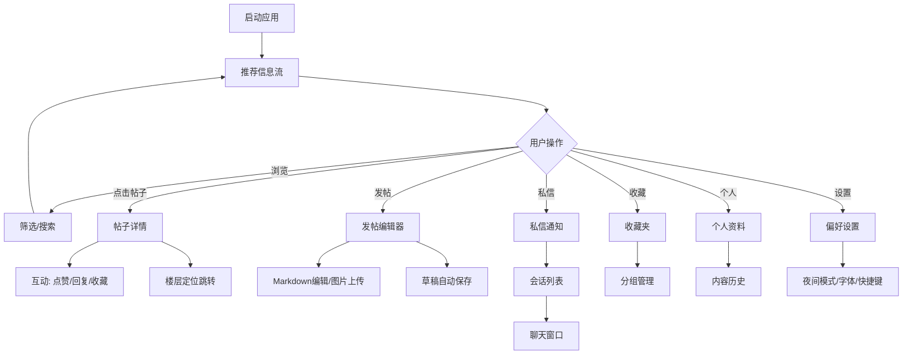

## 1. 产品概述

macOS 论坛桌面客户端是专为 Mac 用户打造的社区讨论工具，提供沉浸式的论坛浏览、互动和内容管理体验。
- 面向 macOS 用户（开发者、爱好者、技术人员），解决网页端体验割裂、通知不及时、功能分散等痛点
- 打造原生 macOS 风格的桌面级应用，提供流畅的浏览、发帖、互动和个性化管理体验

## 2. 核心特性

### 2.1 用户角色
| 角色 | 注册方式 | 核心权限 |
|------|---------|---------|
| 普通用户 | Apple ID / 邮箱注册 | 浏览话题、发帖回复、收藏管理、私信交流、个人设置 |
| 版主/管理员 | 权限分配 | 内容审核、帖子置顶、用户管理、违规处理 |

### 2.2 功能模块
1. **推荐信息流**：个性化内容推荐、热度排序、置顶展示、筛选过滤
2. **分区列表**：板块分类导航、子分区层级、订阅管理、新帖标识
3. **帖子详情**：全文渲染、楼层回复、@提醒、图片展示、引用定位
4. **发帖编辑器**：Markdown 编辑、图片拖拽、草稿保存、预览切换、标签选择
5. **私信通知**：实时对话、未读标记、消息通知、会话分组
6. **收藏夹**：分组管理、内容分类、快速搜索、导入导出
7. **个人资料**：信息展示、发帖历史、回复记录、关注粉丝、成就徽章
8. **偏好设置**：夜间模式、字体缩放、快捷键、通知管理、屏蔽列表、筛选配置

### 2.3 页面详情
| 页面名称 | 模块名称 | 功能描述 |
|---------|---------|---------|
| 推荐信息流 | 顶部导航栏 | 全局搜索、通知入口、用户菜单、快捷按钮 |
| 推荐信息流 | 筛选工具栏 | 系统版本筛选、机型筛选、标签筛选、排序切换 |
| 推荐信息流 | 内容卡片流 | 帖子卡片、置顶标识、热度标签、加载动画 |
| 推荐信息流 | 热门标签栏 | 热门标签云、点击筛选、标签颜色标识 |
| 分区列表 | 分区树导航 | 层级展开/折叠、图标标识、新帖数量 |
| 分区列表 | 分区详情 | 版主信息、规则说明、分区统计 |
| 分区列表 | 帖子列表 | 分区内帖子、精华标识、分页加载 |
| 帖子详情 | 主楼内容区 | Markdown 渲染、图片灯箱、代码高亮 |
| 帖子详情 | 回复楼层区 | 楼层号、回复引用、@定位、举报入口 |
| 帖子详情 | 互动工具栏 | 点赞、收藏、分享、屏蔽、举报 |
| 帖子详情 | 快速回复框 | Markdown 快捷输入、@提及、图片上传 |
| 发帖编辑器 | 编辑区 | Markdown 实时编辑、语法高亮、工具栏 |
| 发帖编辑器 | 预览区 | 实时预览、代码高亮、数学公式渲染 |
| 发帖编辑器 | 上传区 | 拖拽上传、粘贴上传、进度显示、图片管理 |
| 发帖编辑器 | 设置区 | 分区选择、标签设置、草稿状态、定时发布 |
| 私信通知 | 会话列表 | 头像、最后消息、未读数、时间戳、在线状态 |
| 私信通知 | 聊天窗口 | 消息气泡、已读状态、图片发送、表情支持 |
| 私信通知 | 通知中心 | 系统通知、回复提醒、@提醒、系统公告 |
| 收藏夹 | 分组侧边栏 | 分组列表、新建分组、重命名、删除、拖拽排序 |
| 收藏夹 | 收藏内容区 | 卡片展示、分组标签、快捷操作、批量管理 |
| 个人资料 | 个人信息卡 | 头像、昵称、签名、等级、注册时间、统计数据 |
| 个人资料 | 内容标签页 | 发帖/回复/收藏/关注 多标签切换 |
| 偏好设置 | 设置分类 | 通用/外观/通知/隐私/快捷键/关于 分类导航 |
| 偏好设置 | 外观设置 | 夜间模式切换、主题色、字体大小缩放 |
| 偏好设置 | 快捷键设置 | 快捷键列表、自定义绑定、重置默认 |
| 偏好设置 | 内容过滤 | 屏蔽用户列表、关键词过滤、系统版本/机型预设 |

## 3. 核心流程

### 3.1 浏览与互动流程
用户启动客户端 → 进入推荐信息流 → 通过筛选器（系统版本/机型/标签）缩小范围 → 点击感兴趣的帖子 → 浏览详情和楼层回复 → 点赞/收藏/回复 → 返回信息流继续浏览

### 3.2 发帖流程
点击发帖按钮 → 进入编辑器 → 选择分区和标签 → Markdown 输入内容 → 拖拽上传图片 → 实时预览效果 → 自动保存草稿 → 确认发布 → 跳转到帖子详情

### 3.3 私信交流流程
收到新消息通知 → 点击通知进入私信面板 → 选择会话 → 查看消息历史 → 输入回复（支持表情和图片）→ 发送消息 → 实时同步已读状态

### 3.4 收藏管理流程
浏览帖子时点击收藏 → 选择或创建收藏分组 → 进入收藏夹面板 → 按分组查看内容 → 搜索/排序/批量操作 → 导出收藏清单

## 4. 用户界面设计

### 4.1 设计风格
- **主色调**：macOS 原生风格，采用渐变蓝（#007AFF → #5856D6）作为主色，辅助色使用系统橙（#FF9500）和粉（#FF2D55）
- **按钮样式**：圆角胶囊按钮（radius: 8px），hover 微缩放 + 阴影加深，支持毛玻璃效果（NSVisualEffectView 风格）
- **字体方案**：SF Pro Display（显示） + SF Mono（代码） + 苹方（中文），字号层级清晰
- **布局风格**：三栏式布局（左侧导航 + 中间内容 + 右侧详情），支持多窗口浮动面板
- **图标风格**：SF Symbols 风格线性图标，统一线宽 1.5px，支持动态颜色
- **材质风格**：毛玻璃（backdrop-filter: blur）、半透明侧边栏、细腻阴影分层

### 4.2 页面设计概览
| 页面名称 | 模块名称 | UI 元素 |
|---------|---------|---------|
| 推荐信息流 | 顶部导航 | 毛玻璃效果、搜索框聚焦动画、通知徽标脉冲动画 |
| 推荐信息流 | 内容卡片 | 卡片悬浮抬升、图片渐入、标签胶囊、置顶帖金色边框 |
| 分区列表 | 分区树 | 展开折叠旋转动画、活跃项高亮背景、新帖数红点徽标 |
| 帖子详情 | 主楼区 | 代码块复制按钮、图片点击放大、长文折叠展开 |
| 帖子详情 | 楼层区 | 楼层号锚点、引用块缩进样式、@高亮链接 |
| 发帖编辑器 | 编辑/预览 | 左右分栏可拖拽调整、滚动同步、工具栏浮动吸顶 |
| 私信通知 | 聊天窗口 | 消息气泡滑入动画、打字指示器、已读对勾、在线状态绿点 |
| 收藏夹 | 分组管理 | 分组拖拽排序、右键菜单、批量选择操作栏 |
| 偏好设置 | 外观设置 | 主题切换过渡动画、字体滑块实时预览、快捷键录制按钮 |

### 4.3 响应式设计
- **桌面优先**：针对 macOS 优化，默认窗口尺寸 1280×800，支持最小 960×640
- **多窗口支持**：发帖编辑器、私信、设置可弹出为独立浮动窗口
- **分栏适配**：支持拖拽调整侧边栏宽度，双击居中，记忆用户偏好
- **全屏模式**：支持 macOS 全屏模式，布局自动扩展
- **触控板优化**：支持双指缩放图片、三指查找、惯性滚动

### 4.4 动效与微交互
- **窗口切换**：面板切换使用 300ms ease-out 淡入淡出 + 轻微位移
- **加载状态**：骨架屏渐入渐出，信息流无限滚动加载
- **通知提醒**：未读数红点脉冲动画，新消息通知横幅从右侧滑入
- **主题切换**：夜间模式使用 400ms 颜色渐变过渡，背景色先变再过渡其他元素
