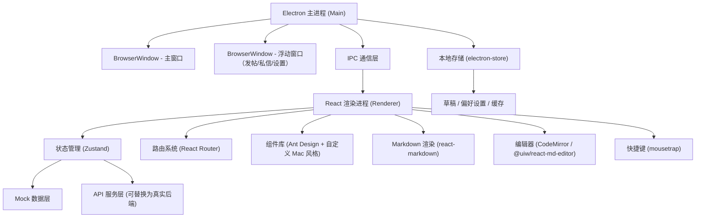
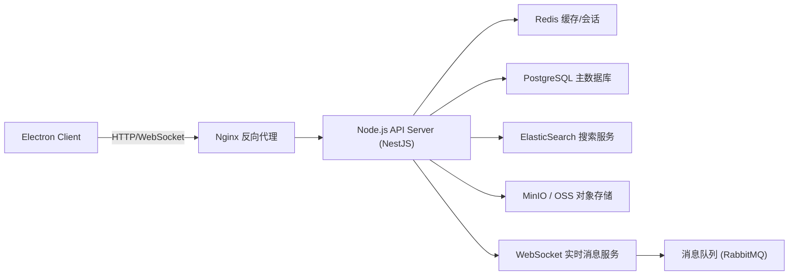

## 1. 架构设计



## 2. 技术选型说明

| 层级 | 技术栈 | 说明 |
|------|--------|------|
| 桌面框架 | Electron@29 | 跨平台桌面应用框架，支持 macOS 原生特性 |
| 前端框架 | React@18 + TypeScript | 组件化开发 + 类型安全 |
| 构建工具 | Vite@5 + electron-vite | 极速开发体验，热更新 |
| 样式方案 | TailwindCSS@3 + CSS Variables | 原子化 + 主题变量，支持动态切换 |
| 状态管理 | Zustand@4 | 轻量级 store，支持持久化 |
| 路由系统 | React Router@6 | Hash 路由，兼容 Electron |
| UI 组件 | Ant Design@5 + 自定义 Mac 组件 | 覆盖基础组件 + 定制 macOS 风格 |
| Markdown 编辑 | @uiw/react-md-editor | 实时预览、拖拽上传、工具栏 |
| Markdown 渲染 | react-markdown + remark-gfm | GFM 语法、代码高亮、数学公式 |
| 代码高亮 | react-syntax-highlighter | Prism 主题支持亮暗模式 |
| 本地存储 | electron-store + localStorage | 偏好设置、草稿、缓存 |
| 快捷键 | mousetrap | 全局和局部快捷键绑定 |
| 图标 | @ant-design/icons + 自定义 SVG | SF Symbols 风格图标 |
| 拖拽上传 | react-dropzone | 图片拖拽、粘贴上传 |

## 3. 路由与窗口定义

### 3.1 主窗口路由
| 路由路径 | 对应面板 | 说明 |
|---------|---------|------|
| `/` | 推荐信息流 | 默认首页，内容瀑布流 |
| `/categories` | 分区列表 | 板块分类导航 |
| `/post/:id` | 帖子详情 | 帖子 + 回复楼层 |
| `/favorites` | 收藏夹 | 收藏分组管理 |
| `/messages` | 私信通知 | 会话列表 + 聊天 |
| `/profile/:id?` | 个人资料 | 用户信息 + 历史内容 |
| `/settings` | 偏好设置 | 系统配置面板 |

### 3.2 独立浮动窗口
| 窗口类型 | 路由路径 | 说明 |
|---------|---------|------|
| 发帖编辑器 | `/editor/new` | 新建帖子，独立窗口 |
| 发帖编辑器 | `/editor/:draftId` | 编辑草稿/帖子 |
| 私信窗口 | `/chat/:conversationId` | 独立私信对话窗 |
| 设置窗口 | `/settings-popup` | 弹出式设置面板 |

## 4. 核心数据模型与 Mock API

### 4.1 TypeScript 类型定义

```typescript
// 用户
interface User {
  id: string;
  username: string;
  nickname: string;
  avatar: string;
  signature?: string;
  level: number;
  macModel?: string;      // 用户机型：如 MacBook Pro 14" M3 Pro
  osVersion?: string;     // 系统版本：如 macOS 14.4 Sonoma
  postCount: number;
  replyCount: number;
  followerCount: number;
  followingCount: number;
  createdAt: string;
  badges: Badge[];
  isBlocked?: boolean;
}

// 分区
interface Category {
  id: string;
  name: string;
  icon: string;
  description?: string;
  parentId?: string;
  children?: Category[];
  postCount: number;
  unreadCount?: number;
  moderators: string[];  // 版主 userIds
}

// 标签
interface Tag {
  id: string;
  name: string;
  color: string;
  hot: boolean;
  postCount: number;
}

// 帖子
interface Post {
  id: string;
  title: string;
  content: string;       // Markdown 原文
  authorId: string;
  author: User;          // 关联用户
  categoryId: string;
  category: Category;
  tags: Tag[];
  isPinned: boolean;     // 是否置顶
  isEssence: boolean;    // 是否精华
  isDraft?: boolean;
  viewCount: number;
  likeCount: number;
  replyCount: number;
  favoriteCount: number;
  osVersion?: string;    // 适用系统版本筛选
  macModel?: string;     // 适用机型筛选
  images: string[];      // 图片列表
  createdAt: string;
  updatedAt: string;
  lastReplyAt?: string;
}

// 回复/楼层
interface Reply {
  id: string;
  postId: string;
  floor: number;         // 楼层号，从 1 开始（1楼即主楼在 posts 表）
  content: string;       // Markdown
  authorId: string;
  author: User;
  replyToId?: string;    // 引用回复的 replyId
  replyToFloor?: number; // 引用回复楼层号
  mentions: string[];    // @的用户Ids
  likeCount: number;
  images: string[];
  createdAt: string;
  isBlocked?: boolean;
}

// 私信会话
interface Conversation {
  id: string;
  participants: User[];
  lastMessage: Message;
  unreadCount: number;
  pinned: boolean;
  updatedAt: string;
}

// 私信消息
interface Message {
  id: string;
  conversationId: string;
  senderId: string;
  content: string;
  type: 'text' | 'image' | 'system';
  readBy: string[];      // 已读用户Ids
  createdAt: string;
}

// 收藏分组
interface FavoriteGroup {
  id: string;
  name: string;
  description?: string;
  color?: string;
  order: number;
  items: FavoriteItem[];
  createdAt: string;
}

// 收藏项
interface FavoriteItem {
  id: string;
  groupId: string;
  targetType: 'post' | 'reply';
  targetId: string;
  target?: Post | Reply;
  remark?: string;
  addedAt: string;
}

// 通知
interface Notification {
  id: string;
  type: 'reply' | 'mention' | 'like' | 'system' | 'message';
  targetId?: string;
  fromUserId?: string;
  fromUser?: User;
  title: string;
  content: string;
  read: boolean;
  createdAt: string;
}

// 草稿
interface Draft {
  id: string;
  title: string;
  content: string;
  categoryId?: string;
  tagIds: string[];
  images: string[];
  osVersion?: string;
  macModel?: string;
  savedAt: string;
  autoSaved: boolean;
}

// 屏蔽项
interface BlockItem {
  id: string;
  type: 'user' | 'keyword';
  targetId: string;     // userId 或 keyword
  targetName: string;
  createdAt: string;
}

// 用户偏好设置
interface UserPreferences {
  theme: 'light' | 'dark' | 'auto';
  accentColor: string;
  fontSize: number;        // 缩放百分比：90/100/110/120/130
  fontFamily: string;
  showAvatars: boolean;
  showSignatures: boolean;
  defaultOsFilter?: string;
  defaultModelFilter?: string;
  notifications: {
    reply: boolean;
    mention: boolean;
    like: boolean;
    message: boolean;
    system: boolean;
    sound: boolean;
    badge: boolean;
  };
  shortcuts: Record<string, string>;
  blockedItems: BlockItem[];
  sidebarWidth: number;
  windowState?: {
    width: number;
    height: number;
    x: number;
    y: number;
    maximized: boolean;
  };
}
```

### 4.2 API 接口定义

```typescript
// Auth API
interface AuthAPI {
  login(username: string, password: string): Promise<User>;
  logout(): Promise<void>;
  getCurrentUser(): Promise<User>;
}

// Posts API
interface PostsAPI {
  getRecommendList(params: {
    page?: number;
    pageSize?: number;
    osVersion?: string;
    macModel?: string;
    tagId?: string;
    sort?: 'hot' | 'latest' | 'essence';
  }): Promise<{ posts: Post[]; total: number }>;

  getCategoryPosts(categoryId: string, params: {
    page?: number;
    sort?: 'latest' | 'hot';
  }): Promise<{ posts: Post[]; total: number }>;

  getPostDetail(id: string): Promise<Post>;

  createPost(data: Partial<Post> & { content: string; title: string; categoryId: string }): Promise<Post>;

  updatePost(id: string, data: Partial<Post>): Promise<Post>;

  deletePost(id: string): Promise<void>;

  togglePin(id: string): Promise<void>;

  likePost(id: string): Promise<void>;

  viewPost(id: string): Promise<void>;
}

// Replies API
interface RepliesAPI {
  getReplyList(postId: string, params: {
    page?: number;
    pageSize?: number;
    floor?: number;     // 定位到具体楼层
  }): Promise<{ replies: Reply[]; total: number }>;

  createReply(postId: string, data: {
    content: string;
    replyToId?: string;
    mentions?: string[];
    images?: string[];
  }): Promise<Reply>;

  likeReply(id: string): Promise<void>;

  reportReply(id: string, reason: string): Promise<void>;
}

// Favorites API
interface FavoritesAPI {
  getGroups(): Promise<FavoriteGroup[]>;
  createGroup(name: string, color?: string): Promise<FavoriteGroup>;
  updateGroup(id: string, data: Partial<FavoriteGroup>): Promise<FavoriteGroup>;
  deleteGroup(id: string): Promise<void>;

  addFavorite(groupId: string, item: Omit<FavoriteItem, 'id' | 'groupId' | 'addedAt'>): Promise<FavoriteItem>;
  removeFavorite(itemId: string): Promise<void>;
  moveFavorite(itemId: string, targetGroupId: string): Promise<void>;

  exportFavorites(): Promise<Blob>;
}

// Messages API
interface MessagesAPI {
  getConversations(): Promise<Conversation[]>;
  getMessages(conversationId: string, params?: { before?: string; limit?: number }): Promise<Message[]>;
  sendMessage(conversationId: string, content: string, type?: 'text' | 'image'): Promise<Message>;
  markAsRead(conversationId: string): Promise<void>;
  markAllAsRead(): Promise<void>;
}

// Notifications API
interface NotificationsAPI {
  getList(params?: { type?: string; read?: boolean; page?: number }): Promise<{ notifications: Notification[]; total: number; unreadCount: number }>;
  markAsRead(ids: string[]): Promise<void>;
  markAllAsRead(): Promise<void>;
}

// User API
interface UserAPI {
  getUserProfile(userId: string): Promise<User & {
    posts: Post[];
    replies: Reply[];
  }>;
  getUserPosts(userId: string, params?: { page?: number }): Promise<Post[]>;
  getUserReplies(userId: string, params?: { page?: number }): Promise<Reply[]>;
  getUserFavorites(userId: string): Promise<FavoriteGroup[]>;
  followUser(userId: string): Promise<void>;
  unfollowUser(userId: string): Promise<void>;
  blockUser(userId: string): Promise<void>;
  unblockUser(userId: string): Promise<void>;
  updateProfile(data: Partial<User>): Promise<User>;
}

// Drafts API
interface DraftsAPI {
  getList(): Promise<Draft[]>;
  get(id: string): Promise<Draft>;
  save(data: Partial<Draft> & { content: string }): Promise<Draft>;
  delete(id: string): Promise<void>;
}

// Search API
interface SearchAPI {
  search(keyword: string, params?: {
    scope?: 'post' | 'reply' | 'user' | 'tag';
    categoryId?: string;
    osVersion?: string;
    macModel?: string;
    page?: number;
  }): Promise<{
    posts?: Post[];
    users?: User[];
    tags?: Tag[];
    total: number;
  }>;
}

// Upload API
interface UploadAPI {
  uploadImage(file: File | Blob, onProgress?: (p: number) => void): Promise<{ url: string; width: number; height: number }>;
  uploadImageFromClipboard(data: DataTransfer): Promise<{ url: string }[]>;
}

// Categories API
interface CategoriesAPI {
  getTree(): Promise<Category[]>;
  getCategory(id: string): Promise<Category & { rules?: string }>;
  subscribe(id: string): Promise<void>;
  unsubscribe(id: string): Promise<void>;
}

// Tags API
interface TagsAPI {
  getHotTags(limit?: number): Promise<Tag[]>;
  searchTags(keyword: string): Promise<Tag[]>;
}

// Report API
interface ReportAPI {
  reportPost(postId: string, reason: string, detail?: string): Promise<void>;
  reportReply(replyId: string, reason: string, detail?: string): Promise<void>;
  reportUser(userId: string, reason: string, detail?: string): Promise<void>;
}
```

## 5. 服务端架构（可选扩展，当前使用 Mock）



## 6. 快捷键映射（默认配置）

| 功能 | Windows/Linux | macOS | 全局 |
|------|--------------|-------|------|
| 新建帖子 | Ctrl+N | ⌘N | 是 |
| 搜索 | Ctrl+K | ⌘K | 是 |
| 打开设置 | Ctrl+, | ⌘, | 是 |
| 切换夜间模式 | Ctrl+Shift+L | ⌘⇧L | 是 |
| 打开私信 | Ctrl+Shift+M | ⌘⇧M | 是 |
| 打开收藏夹 | Ctrl+Shift+F | ⌘⇧F | 是 |
| 返回上一页 | Alt+← | ⌘← | 否 |
| 前进下一页 | Alt+→ | ⌘→ | 否 |
| 切换到推荐 | Ctrl+1 | ⌘1 | 是 |
| 切换到分区 | Ctrl+2 | ⌘2 | 是 |
| 切换到消息 | Ctrl+3 | ⌘3 | 是 |
| 切换到收藏 | Ctrl+4 | ⌘4 | 是 |
| 切换到个人 | Ctrl+5 | ⌘5 | 是 |
| 保存草稿 | Ctrl+S | ⌘S | 编辑器内 |
| 发布帖子 | Ctrl+Enter | ⌘↩ | 编辑器内 |
| 插入链接 | Ctrl+L | ⌘L | 编辑器内 |
| 插入图片 | Ctrl+Shift+I | ⌘⇧I | 编辑器内 |
| 粗体 | Ctrl+B | ⌘B | 编辑器内 |
| 斜体 | Ctrl+I | ⌘I | 编辑器内 |

## 7. 开发规范

### 7.1 目录结构
```
src/
├── main/                 # Electron 主进程
│   ├── index.ts          # 主进程入口
│   ├── windows.ts        # 窗口管理
│   ├── ipc.ts            # IPC 通信
│   ├── store.ts          # electron-store
│   └── menu.ts           # 原生菜单栏
├── renderer/             # React 渲染进程
│   ├── main.tsx          # 渲染入口
│   ├── App.tsx           # 根组件
│   ├── router.tsx        # 路由配置
│   ├── stores/           # Zustand stores
│   ├── api/              # API 封装层
│   ├── mock/             # Mock 数据
│   ├── components/       # 通用组件
│   ├── layouts/          # 布局组件
│   ├── pages/            # 页面组件
│   │   ├── Feed/         # 推荐信息流
│   │   ├── Categories/   # 分区列表
│   │   ├── PostDetail/   # 帖子详情
│   │   ├── Editor/       # 发帖编辑器
│   │   ├── Messages/     # 私信通知
│   │   ├── Favorites/    # 收藏夹
│   │   ├── Profile/      # 个人资料
│   │   └── Settings/     # 偏好设置
│   ├── hooks/            # 自定义 Hooks
│   ├── utils/            # 工具函数
│   ├── styles/           # 全局样式/主题
│   └── types/            # 类型定义
└── shared/               # 主/渲染共享代码
```

### 7.2 提交规范
- feat: 新功能
- fix: 修复 Bug
- style: 样式调整
- refactor: 代码重构
- perf: 性能优化
- test: 测试相关
- docs: 文档更新
- chore: 构建/工具链
